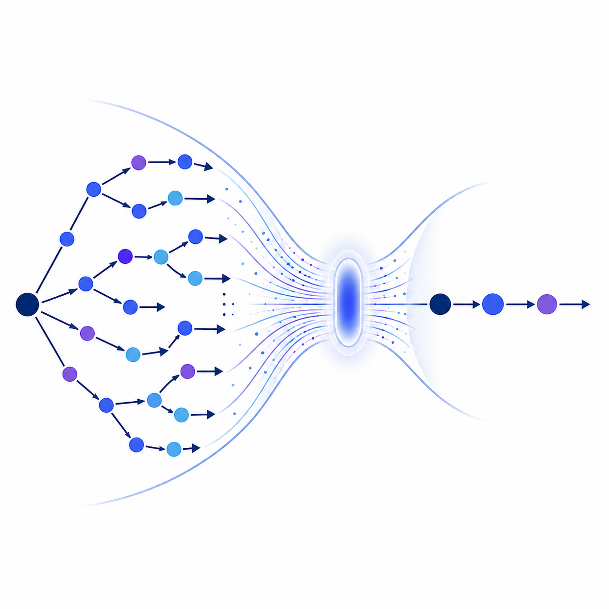
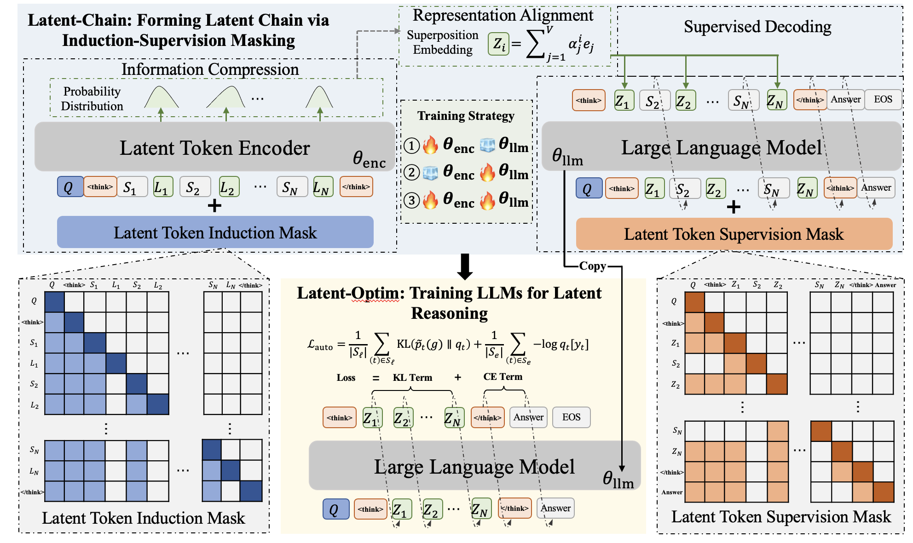

<div align="center">
  

  <h2>Latent-SFT: LLM Latent Reasoning as Chain of Superposition</h2>

  <p>
    <a href="https://arxiv.org/abs/2510.15522"></a>
    <a href="https://huggingface.co/datasets/DJCheng/Latent-SFT-Data"></a>
    
    
  </p>

  <p><strong>Official implementation of Latent-SFT, a two-stage framework for teaching LLMs to reason in vocabulary-space latent chains.</strong></p>
</div>

---

## News

- **Latent GRPO**: Our follow-up RL-stage work extends latent-chain reasoning to GRPO-style reinforcement learning. See the paper here: [Latent GRPO](https://arxiv.org/pdf/2604.27998).
- **2026-01-30**: The latest version of the paper is available on arXiv: [LLM Latent Reasoning as Chain of Superposition](https://arxiv.org/abs/2510.15522).
- **Code release**: This repository provides the training, latent soft-label generation, LoRA merging, and evaluation pipeline used by Latent-SFT.

## Overview

Latent reasoning aims to reduce the cost of explicit Chain-of-Thought (CoT) reasoning by allowing a model to perform intermediate reasoning in a compact latent form. However, unconstrained latent states can be difficult to optimize and may suffer from semantic ambiguity.

**Latent-SFT** addresses this by viewing latent reasoning as a **chain of superposition** in the LLM vocabulary space. Instead of treating latent states as arbitrary hidden vectors, Latent-SFT represents each latent token as a probability distribution over the vocabulary. This yields a structured latent space that remains closely aligned with the model's pretrained lexical semantics.

The framework is organized around three core components:

- **Latent-Vocab**: Constrains latent states to the vocabulary embedding space through top-k lexical superposition.
- **Latent-Chain**: Uses induction-supervision masking to distill compact latent chains from explicit CoT traces.
- **Latent-Optim**: Trains the model to autonomously generate latent chains using CE and KL objectives, with optional stochastic Gumbel-Softmax perturbation for better generalization.



## Repository Structure

```text
Latent-SFT/
├── config_zero1.json
├── data/
├── eval/
├── figs/
│   └── latent_reasoning_logo.svg
├── generate_latent_soft_label_lora_batch.py
├── generate_latent_soft_label_hf_batch.py
├── merge_lora.py
├── requirements.txt
├── script/
│   ├── run_distill_stage1_encoder_{task}.sh
│   ├── run_distill_stage1_decoder_{task}.sh
│   ├── run_distill_stage1_union_{task}.sh
│   └── run_distill_stage2_{task}.sh
└── src/
    ├── modeling/
    │   ├── modeling_stage1.py
    │   └── modeling_stage2.py
    ├── stage1/
    └── stage2/
```

Only core files and directories are shown here. Task-specific scripts, evaluation utilities, and generated outputs are omitted for brevity.

The `{task}` suffix denotes the task or difficulty configuration. Current examples include:

- `gsm8k`
- `math500`

## Installation

We recommend using a clean Python environment.

```bash
conda create -n latent-sft python=3.12 -y
conda activate latent-sft
pip install -r requirements.txt
```

The current reference environment uses:

- `python==3.12.3`
- `torch==2.5.1`
- `Deepspeed==0.17.0`
- `peft==0.15.2`
- `flash-attn==2.7.3`

> **Note:** `flash-attn` may require a compatible CUDA toolkit and can take a long time to compile. If installation fails, please verify your CUDA, PyTorch, and compiler versions first.

## Data Preparation

Download the training and evaluation data from Hugging Face:

- [DJCheng/Latent-Reasoning-Data](https://huggingface.co/datasets/DJCheng/Latent-Reasoning-Data)

Place or extract the files under the repository-level `data/` directory:

```bash
mkdir -p data
# Example only. Replace with the actual files downloaded from Hugging Face.
# unzip Latent-SFT-Data.zip -d data/
```

After preparation, update the `train_data_path` field in the corresponding shell scripts, for example:

```bash
train_data_path="${REPO_ROOT}/data/<your-train-file>.jsonl"
```

For the released task settings, use the following training and evaluation files:

| Setting | Training file | In-domain evaluation file | OOD evaluation files |
| --- | --- | --- | --- |
| Low-difficulty tasks | `GSM8k-Aug-train.jsonl` | `GSM8k-Aug-test.jsonl` | `GSM8k-Hard-test.jsonl`<br>`Multiarith-test.jsonl`<br>`Svamp-test.jsonl` |
| High-difficulty tasks | `OpenR1-Math-220k-v-train-4k.jsonl` | - | `Math-500-test.jsonl`<br>`GPQA-test.jsonl`<br>`AIME-2024-test.jsonl`<br>`AIME-2025-test.jsonl` |

Training data examples are expected to contain the `problem`, `cot`, and `cot_answer` fields. Test data examples are expected to contain the `problem`, `solution`, and `answer` fields.

> [!IMPORTANT]
> The data-format handling in this codebase is tightly coupled to these schemas. When using your own data, please check the field names and contents carefully before training or evaluation.

## Training Pipeline

Latent-SFT follows the paper's two-stage procedure:

1. **Stage 1: Latent-chain construction**
   - Learn an encoder-decoder system that compresses explicit CoT traces into latent vocabulary-space superpositions.
   - This corresponds to **Latent-Vocab** and **Latent-Chain** in the paper.
2. **Stage 2: Autonomous latent reasoning**
   - Discard the stage-1 encoder.
   - Train the LLM to generate the latent chain by itself and then decode the final answer.
   - This corresponds to **Latent-Optim** in the paper.

The recommended execution order is:

```bash
bash script/run_distill_stage1_encoder_{task}.sh
bash script/run_distill_stage1_decoder_{task}.sh
bash script/run_distill_stage1_union_{task}.sh
python generate_latent_soft_label_lora_batch.py ...
python merge_lora.py ...
bash script/run_distill_stage2_{task}.sh
```

Replace `{task}` with the desired task configuration, such as `gsm8k` or `math500`.

Stage 1 is optimized through three consecutive steps rather than a single end-to-end run. The explicit vocabulary-space constraint makes latent-chain learning more structured, but it also slows convergence and makes the full encoder-decoder objective harder to optimize directly. We therefore first train the encoder, then train the decoder conditioned on the learned latent chains, and finally jointly optimize the encoder-decoder system.

After each Stage-1 step, evaluate the corresponding checkpoint and use the best-performing checkpoint as the input to the next step. For low-difficulty tasks, we recommend using `GSM8k-Aug-test.jsonl` as the Stage-1 evaluation set; for high-difficulty tasks, we recommend using `Math-500-test.jsonl`.

### Step 1: Train the Stage-1 Encoder

```bash
bash script/run_distill_stage1_encoder_{task}.sh
```

This step trains the latent token encoder. Edit the following important fields in the script:

```bash
output_name="<your-run-name>"
encoder_name_or_path="<path-or-hf-id-of-your-base-model>"
decoder_name_or_path="<path-or-hf-id-of-your-base-model>"
train_data_path="${REPO_ROOT}/data/<your-train-file>.jsonl"
compression_rate=2
topk_interpolation=10
```

Important parameters:

- **`compression_rate`**: Controls how many explicit CoT tokens are compressed into one latent token. Larger values produce shorter latent chains but make optimization harder.
- **`topk_interpolation`**: Controls the number of vocabulary tokens used to approximate each latent state as a lexical superposition. Larger values preserve more lexical information but increase memory and compute cost.

Evaluate encoder checkpoints with:

```bash
python eval/eval_encoder_hf_batch.py \
  --dataset <GSM8k|Math500> \
  --data_path data/<your-eval-file>.jsonl \
  --check_point <checkpoint-step> \
  --encoder_name_or_path <path-to-stage1-encoder-run-dir> \
  --decoder_name_or_path <path-or-hf-id-of-your-base-model> \
  --save_path <path-to-save-eval-results> \
  --compression_rate 2 \
  --topk_interpolation 10
```

Here `--encoder_name_or_path` should point to the encoder run directory; the script loads `<encoder_name_or_path>/checkpoint-<check_point>/hf`. Keep `--compression_rate` and `--topk_interpolation` consistent with training, and select the best encoder checkpoint for Step 2.

### Step 2: Train the Stage-1 Decoder

```bash
bash script/run_distill_stage1_decoder_{task}.sh
```

This step trains the decoder conditioned on latent chains generated by the encoder. Set:

```bash
encoder_name_or_path="<path-to-stage1-encoder-checkpoint>"
decoder_name_or_path="<path-or-hf-id-of-your-base-model>"
train_data_path="${REPO_ROOT}/data/<your-train-file>.jsonl"
compression_rate=2
topk_interpolation=10
```

The `compression_rate` and `topk_interpolation` should remain consistent with the encoder configuration unless you intentionally run a new ablation.

Evaluate decoder checkpoints with:

```bash
python eval/eval_decoder_hf_batch.py \
  --dataset <GSM8k|Math500> \
  --data_path data/<your-eval-file>.jsonl \
  --check_point <checkpoint-step> \
  --encoder_name_or_path <path-to-best-stage1-encoder-checkpoint-hf> \
  --decoder_name_or_path <path-to-stage1-decoder-run-dir> \
  --save_path <path-to-save-eval-results> \
  --compression_rate 2 \
  --topk_interpolation 10
```

Here `--encoder_name_or_path` should be the best encoder checkpoint selected after Step 1, while `--decoder_name_or_path` should point to the decoder run directory; the script loads `<decoder_name_or_path>/checkpoint-<check_point>/hf`. Use the best decoder checkpoint for Step 3.

### Step 3: Joint Stage-1 Optimization

```bash
bash script/run_distill_stage1_union_{task}.sh
```

This step jointly optimizes the encoder-decoder system. Set:

```bash
encoder_name_or_path="<path-to-stage1-encoder-checkpoint-hf>"
decoder_name_or_path="<path-to-stage1-decoder-checkpoint-hf>"
train_data_path="${REPO_ROOT}/data/<your-train-file>.jsonl"
compression_rate=2
topk_interpolation=10
```

The union run saves LoRA adapter weights. These weights are used in the next step to generate latent soft labels.

Evaluate union checkpoints with:

```bash
python eval/eval_union_hf_batch.py \
  --dataset <GSM8k|Math500> \
  --data_path data/<your-eval-file>.jsonl \
  --check_point <checkpoint-step> \
  --encoder_name_or_path <path-to-best-stage1-encoder-checkpoint-hf> \
  --decoder_name_or_path <path-to-best-stage1-decoder-checkpoint-hf> \
  --lora_path <path-to-stage1-union-run-dir> \
  --save_path <path-to-save-eval-results> \
  --compression_rate 2 \
  --topk_interpolation 10
```

Here `--lora_path` should point to the union run directory; the script loads `<lora_path>/checkpoint-<check_point>/lora_adapter`. Use the best union checkpoint for latent soft-label generation.

### Step 4: Generate Latent Soft Labels

Use the stage-1 union model to generate chunked latent soft labels for the training set:

```bash
python generate_latent_soft_label_lora_batch.py \
  --encoder_model_path <path-to-stage1-encoder-checkpoint-hf> \
  --decoder_model_path <path-to-stage1-decoder-checkpoint-hf> \
  --lora_path <path-to-stage1-union-lora-adapter> \
  --save_path <path-to-save-latent-soft-label-chunks> \
  --data_path data/<your-train-file>.jsonl \
  --mp_size 8 \
  --batch_size 16 \
  --dtype bfloat16 \
  --compression_rate 2 \
  --topk_interpolation 10
```

This script writes chunked files named like:

```text
batch_0_1000.pt
batch_1000_2000.pt
...
```

These chunks are later consumed by `run_distill_stage2_{task}.sh` through `train_latent_soft_label_path`.

Important parameters:

- **`--compression_rate`** must match the Stage-1 compression rate.
- **`--topk_interpolation`** should match the Stage-1 top-k superposition setting.
- **`--mp_size`** controls the number of GPU worker processes used for latent-label generation.
- **`--batch_size`** controls per-dispatch generation batch size.

### Step 5: Merge Stage-1 Decoder LoRA Weights

Before Stage 2, merge the decoder LoRA adapter into the base decoder checkpoint:

```bash
python merge_lora.py \
  --base_model_path <path-to-stage1-decoder-base-or-hf-checkpoint> \
  --lora_path <path-to-stage1-decoder-lora-adapter> \
  --output_path <path-to-save-merged-decoder> \
  --output_subdir decoder_hf \
  --dtype bfloat16 \
  --attn_implementation sdpa \
  --device_map auto
```

The merged model will be saved to:

```text
<path-to-save-merged-decoder>/decoder_hf
```

Use this merged decoder checkpoint as the initialization for Stage 2.

### Step 6: Train the Stage-2 Latent Reasoning Model

```bash
bash script/run_distill_stage2_{task}.sh
```

Edit the following fields:

```bash
output_name="<your-stage2-run-name>"
latent_model_path="<path-to-merged-stage1-decoder-hf>"
train_data_path="${REPO_ROOT}/data/<your-train-file>.jsonl"
train_latent_soft_label_path="<path-to-train-latent-soft-label-chunks>"
```

Stage 2 optimizes the model with CE loss on final answers and KL loss on latent soft labels. The key Gumbel-Softmax parameters are:

```bash
--add_gumbel_noise True \
--gumbel_temperature 1.0 \
--noise_scale 1.0 \
```

Recommended practice:

- Keep **`--gumbel_temperature 1.0`** fixed unless you are deliberately running a controlled ablation.
- Tune **`--noise_scale`** to control the strength of stochastic perturbation.
- Use **`--add_gumbel_noise True`** for the default Latent-Optim setting.

## Parameter Guide

| Parameter | Stage | Meaning | Recommendation |
|---|---:|---|---|
| `compression_rate` | Stage 1 / soft-label generation | Number of explicit CoT tokens compressed per latent token | Main control for latent chain length; keep consistent across Stage 1 and label generation |
| `topk_interpolation` | Stage 1 / soft-label generation | Number of vocabulary tokens used in each latent superposition | Keep consistent when transferring labels to Stage 2 |
| `--add_gumbel_noise` | Stage 2 | Enables stochastic perturbation of latent soft labels | Recommended: `True` |
| `--gumbel_temperature` | Stage 2 | Temperature for Gumbel-Softmax normalization | Recommended: keep at `1.0` |
| `--noise_scale` | Stage 2 | Strength of injected Gumbel noise | Recommended knob for robustness/ablation |
| `--ce_w` | Stage 2 | Weight of final-answer CE loss | Default: `1.0` |
| `--kl_w` | Stage 2 | Weight of latent soft-label KL loss | Default: `1.0` |

## Evaluation

The repository provides batch evaluation scripts under `eval/`, including:

```text
eval/eval_encoder_hf_batch.py
eval/eval_decoder_hf_batch.py
eval/eval_union_hf_batch.py
eval/eval_latent_model_hf_batch.py
eval/eval_math500_sglang.py
```

Typical usage is to edit the model path, data path, output path, and decoding parameters inside the corresponding evaluation script, then launch it with Python.

For final reporting, please ensure that output filenames include the task name, model name, and important sampling or latent-reasoning parameters to avoid overwriting results from different experimental settings.

## Citation

If you find this repository useful, please cite our papers:

```bibtex
@article{deng2025latentreasoning,
  title        = {LLM Latent Reasoning as Chain of Superposition},
  author       = {Deng, Jingcheng and Pang, Liang and Wei, Zihao and Xu, Shicheng and Duan, Zenghao and Xu, Kun and Song, Yang and Shen, Huawei and Cheng, Xueqi},
  journal      = {arXiv preprint arXiv:2510.15522},
  year         = {2025},
  url          = {https://arxiv.org/abs/2510.15522}
}

@article{deng2026latentgrpo,
  title        = {Latent-GRPO: Group Relative Policy Optimization for Latent Reasoning},
  author       = {Deng, Jingcheng and Wei, Zihao and Pang, Liang and Wu, Junhong and Xu, Shicheng and Duan, Zenghao and Shen, Huawei},
  journal      = {arXiv preprint arXiv:2604.27998},
  year         = {2026},
  url          = {https://arxiv.org/abs/2604.27998}
}
```

## Acknowledgements

This project builds on the Hugging Face Transformers, PyTorch, DeepSpeed, PEFT, and FlashAttention ecosystems. We thank the open-source community for providing the foundation that makes efficient latent reasoning research possible.

## License

Please refer to the repository license for usage terms.
